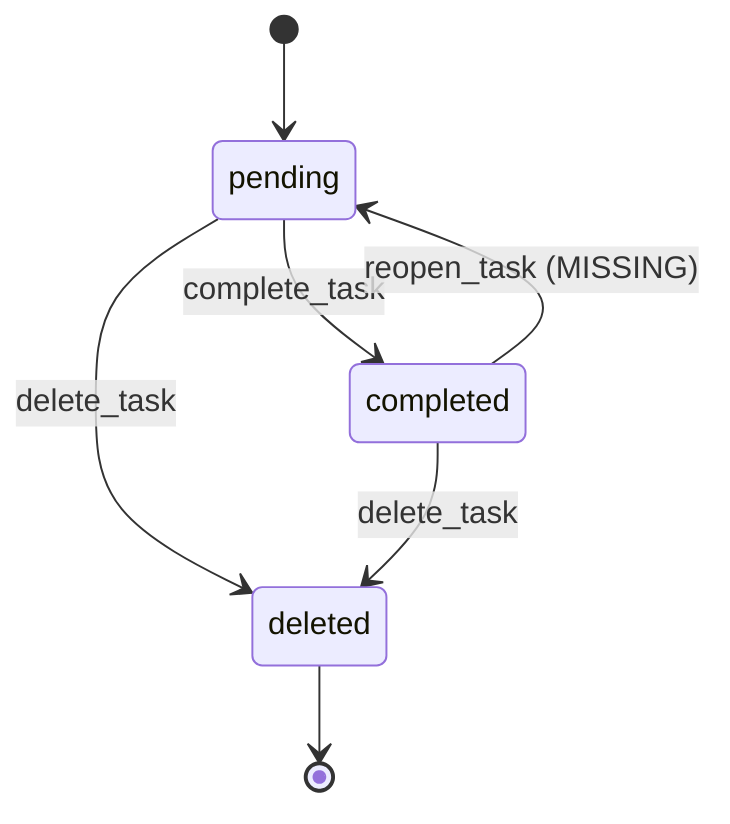

Your task is to analyze domain entity state machines and verify consistency—ensuring all valid transitions are defined, invalid transitions are caught, and no states are unreachable or orphaned.

# QA State Transition Verification Skill (Phase 1)

## Purpose

Validate state machine integrity:
- **Consistency**: All transitions are valid and well-defined
- **Completeness**: No missing transitions or unreachable states
- **Safety**: Invalid transitions are properly handled
- **Documentation**: State model is clearly documented

## When to Use

Invoke this skill automatically when:
- **After** `/sp.specify` defines entity state models
- **Before** `/sp.plan` to ensure architecture consistency
- **During** `/sp.tasks` to verify state handling in tests
- **Any time** state transitions are modified

## Inputs

| Parameter | Required | Description |
|-----------|----------|-------------|
| `spec` | Yes | Path to spec.md file |
| `domain_model` | No | Path to separate domain model (optional) |
| `strict` | No | `true` = fail on any inconsistency (default: true) |

## Step-by-Step Process

### Phase 1: Extract State Models

Parse all entity state definitions:

```python
# Automated extraction
1. Read spec.md file
2. Find all ## State Model sections
3. For each entity, extract:
   - Valid states (e.g., pending, completed, deleted)
   - Initial state(s)
   - Terminal state(s) (if any)
   - Defined transitions (from → to)
4. Build state machine graph for each entity
```

**Failure Handling:**
- Spec file missing: Fail; specification required
- No state models found: Warn; spec may not define states

### Phase 2: Build Transition Matrix

Construct state transition table:

**Task State Machine Example:**
```
Valid States: [pending, completed, deleted]
Initial: pending
Terminal: None (all states accessible)

Defined Transitions:
  pending → completed  (complete)
  pending → deleted    (delete)
  completed → pending  (reopen) - Allow?
  completed → deleted  (delete)
  deleted → pending    (restore) - Phase II?
  deleted → completed  (complete) - Allow?
```

**Matrix Format:**
| From \ To | pending | completed | deleted |
|-----------|---------|-----------|---------|
| pending   | -       | ✅        | ✅      |
| completed | ✅?     | -         | ✅      |
| deleted   | ✅?     | ✅?       | -       |

### Phase 3: Validate State Invariants

Check for invariant violations:

**1. Reachability Check:**
| Check | Issue | Severity |
|-------|-------|----------|
| Can all states be reached from initial? | Orphaned state | HIGH |
| Can initial state be reached? | Invalid initial | HIGH |
| Are there disconnected components? | Split state machine | HIGH |

**2. Terminal State Check:**
| Check | Issue | Severity |
|-------|-------|-----------|
| Can terminal states be left? | Terminal not terminal | HIGH |
| Are terminal states reachable? | Unreachable terminal | MEDIUM |

**3. Transition Completeness:**
| Check | Issue | Severity |
|-------|-------|----------|
| Are common operations missing? | Missing transition | HIGH |
| Are reverse transitions defined? | No undo option | LOW |
| Are delete operations defined? | No way to remove | MEDIUM |

### Phase 4: Identify Invalid Transitions

For each potential transition not in defined set:

**Invalid Transition Analysis:**
| From | To | Scenario | Severity |
|------|-----|----------|----------|
| deleted | pending | Restore deleted task | LOW |
| deleted | completed | Complete deleted task | HIGH |
| non-existent | pending | Create with invalid state | HIGH |

**Handling Classification:**
- **CRITICAL**: Should never happen (data corruption risk)
- **HIGH**: Should return error (invalid operation)
- **MEDIUM**: Might be allowed (Phase II feature)
- **LOW**: Design decision (document preference)

### Phase 5: Verify Transition Handlers

Check each transition has corresponding operation:

**Transition → Operation Mapping:**
| Transition | Operation | AC Exists? |
|------------|-----------|------------|
| pending → completed | complete_task() | ✅ Yes |
| pending → deleted | delete_task() | ✅ Yes |
| completed → pending | reopen_task() | ❌ No |
| deleted → pending | restore_task() | ❌ No |

**Missing Operations Flag:**
- Operation exists but transition not defined
- Transition defined but no operation
- Mismatch between transition and operation behavior

### Phase 6: Check Error Handling

Verify invalid transitions are handled:

**Required Error Handling:**
| Invalid Transition | Required Handling |
|-------------------|-------------------|
| completed → completed | Success (idempotent) or ignore |
| deleted → completed | Error "Task not found" |
| non-existent → any | Error "Task not found" |
| any → invalid state | Error "Invalid state" |

### Phase 7: Generate Verification Report

Output structured report:

```
## State Transition Verification Report

### Summary
- Entities with state models: N
- Total states defined: N
- Total transitions defined: N
- Critical issues: C | High: H | Medium: M | Low: L
- Result: PASS | WARN | FAIL

### Entity: Task
#### State Model
```
Valid States: pending, completed, deleted
Initial State: pending
Terminal States: None
```

#### Transition Matrix
| From \ To | pending | completed | deleted |
|-----------|---------|-----------|---------|
| pending   | -       | ✅ (complete) | ✅ (delete) |
| completed | ✅ (reopen) | - | ✅ (delete) |
| deleted   | ⚠️ (restore) | ⚠️ (complete) | - |

Legend: ✅ Defined | ⚠️ Missing/Undefined | - Self (no-op)

#### Valid Transitions (Approved)
1. pending → completed (via complete_task)
   - Precondition: Task is pending
   - Postcondition: Task.status = 'completed'
   - Error If: Task doesn't exist, already completed
   - Status: ✅ VALID

2. pending → deleted (via delete_task)
   - Precondition: Task is pending
   - Postcondition: Task removed from list
   - Error If: Task doesn't exist, already deleted
   - Status: ✅ VALID

3. completed → deleted (via delete_task)
   - Precondition: Task is completed
   - Postcondition: Task removed from list
   - Error If: Task doesn't exist
   - Status: ✅ VALID

#### Critical Issues (Must Fix)
1. completed → pending (reopen) has no operation
   - Transition: completed → pending is valid
   - Issue: No reopen_task() operation defined
   - Required: Define operation or explicitly disallow
   - Severity: HIGH

2. deleted → completed lacks error handling
   - Transition: deleted → completed not in valid set
   - Issue: No error defined for this case
   - Required: "Error: Task not found" for deleted task
   - Severity: HIGH

#### Warnings (Should Review)
1. deleted → pending (restore) is undefined
   - Status: Phase II feature (out of scope)
   - Recommendation: Document as "not allowed in Phase I"

2. deleted → completed is undefined
   - Status: Should error or Phase II?
   - Recommendation: Error "Cannot complete deleted task"

#### Completeness Assessment
| Check | Status |
|-------|--------|
| All states reachable from initial | ✅ |
| No disconnected state components | ✅ |
| Common operations have transitions | ⚠️ 1 missing |
| Delete operations defined | ✅ |
| Error handling specified | ⚠️ 2 missing |

#### Operation-Transition Matrix
| Operation | From State | To State | Transition Defined |
|-----------|------------|----------|-------------------|
| add_task | (new) | pending | ✅ implicit |
| list_tasks | (any) | (same) | N/A |
| update_task | pending | pending | ✅ |
| complete_task | pending | completed | ✅ |
| complete_task | completed | completed | ⚠️ idempotent? |
| delete_task | pending | deleted | ✅ |
| delete_task | completed | deleted | ✅ |
| delete_task | deleted | deleted | ⚠️ error? |

### State Machine Diagram (Mermaid)


### Recommendations
1. Define reopen_task() operation or explicitly disallow
2. Add error handling for deleted → completed
3. Clarify idempotency requirements for complete/delete
4. Document restore (deleted → pending) as Phase II
```

### Phase 8: Verify Against Acceptance Criteria

Cross-reference state transitions with ACs:

**AC → Transition Mapping:**
| AC | Implies Transition | Verified? |
|----|-------------------|-----------|
| "Task can be marked complete" | pending → completed | ✅ |
| "Deleted task no longer appears" | any → deleted | ✅ |
| "Complete task can be reopened" | completed → pending | ❌ NOT VERIFIED |

**Missing ACs:**
- List ACs that aren't covered by transitions
- Flag transitions without corresponding ACs

## Failure Handling

| Scenario | Handling |
|----------|----------|
| Spec file missing | Fail; specification required |
| No state models found | Warn; no state to verify |
| Unreachable state detected | FAIL; data corruption risk |
| Missing critical transition | FAIL; feature incomplete |
| Only warnings | WARN; proceed with fixes |
| All checks pass | PASS; state model valid |

## Owned By

**todo-domain-expert** - Primary validator of domain state consistency

## Reusability

This skill is deterministic:
- Same state model always produces same verification
- Issue classification follows fixed rules
- Diagram generation is template-based
- Pass/fail determination is rule-based

## Examples

### Standard Verification
```
Skill: sp.qa-state-transition-verify
Spec: specs/todo-app/spec.md
Strict: true
```

### With Domain Model
```
Skill: sp.qa-state-transition-verify
Spec: specs/todo-app/spec.md
Domain: specs/todo-app/domain.md
Strict: true
```

### Lenient (Warnings Only)
```
Skill: sp.qa-state-transition-verify
Spec: specs/todo-app/spec.md
Strict: false
```

---

As the main request completes, you MUST create and complete a PHR (Prompt History Record) using agent-native tools when possible.

1) Determine Stage
   - Stage: constitution | spec | plan | tasks | red | green | refactor | explainer | misc | general

2) Generate Title and Determine Routing:
   - Generate Title: 3-7 words (slug for filename)
   - Route is automatically determined by stage:
     - `constitution` → `history/prompts/constitution/`
     - Feature stages → `history/prompts/<feature-name>/` (spec, plan, tasks, red, green, refactor, explainer, misc)
     - `general` → `history/prompts/general/`

3) Create and Fill PHR (Shell first; fallback agent-native)
   - Run: `.specify/scripts/bash/create-phh.sh --title "<title>" --stage <stage> [--feature <name>] --json`
   - Open the file and fill remaining placeholders (YAML + body), embedding full PROMPT_TEXT (verbatim) and concise RESPONSE_TEXT.
   - If the script fails:
     - Read `.specify/templates/phr-template.prompt.md` (or `templates/...`)
     - Allocate an ID; compute the output path based on stage from step 2; write the file
     - Fill placeholders and embed full PROMPT_TEXT and concise RESPONSE_TEXT.

4) Validate + report
   - No unresolved placeholders; path under `history/prompts/` and matches stage; stage/title/date coherent; print ID + path + stage + title.
   - On failure: warn, don't block. Skip only for `/sp.phr`.
